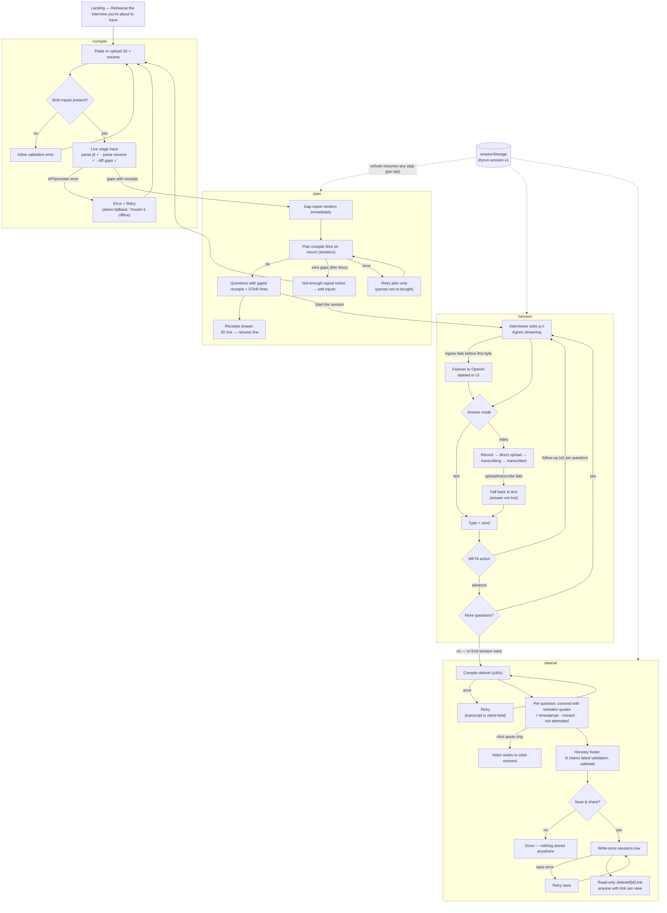

# DryRun — user journey (pinned 27 Jul 2026)

The canonical journey for the rehearsal product. FE builds to this; Vedika's storyboard follows the happy path top-to-bottom. Rendered SVG: `user-journey-2026-07-27.svg`.

## Edge-state inventory (every state the FE must render)

| # | Surface | State | Behavior | Copy stance |
|---|---|---|---|---|
| 1 | /compile | Empty/partial input | Submit disabled until both fields present (`&&`, fixing the old `\|\|` bug) | neutral |
| 2 | /compile | SSE stage trace | Streamed stages render as they land; elapsed timer | "compiling your interview" |
| 3 | /compile | API/provider error | Message + Retry; JSON error body surfaced (not `500 Internal Server Error`) | plain-language, no stack traces |
| 4 | /compile | Offline demo | `?mock=1` keyword-overlap fallback, visibly labeled "offline demo mode" | honest label mandatory |
| 5 | /plan | Gaps in, plan compiling | Gap cards render immediately; question list shows skeleton | progress, not spinner-only |
| 6 | /plan | Zero gaps | "Not enough signal in these documents" → back to /compile | never fabricate gaps |
| 7 | /plan | Plan error | Retry re-runs plan only (client re-sends stored parses) | — |
| 8 | /plan | Receipts drawer | Any gapId chip opens JD span + resume span side-by-side | verbatim quotes only |
| 9 | /session | Provider failover | Agnes error before first byte → one OpenAI retry; provider chip updates + "failover" tag | labeled, never silent |
| 10 | /session | Video: recording | Recorder states: idle → recording (timer) → uploading → transcribing → transcribed | — |
| 11 | /session | Video: failure | Any video step fails → composer falls back to text; typed draft preserved | "camera's optional" |
| 12 | /session | Follow-up cap | Client enforces ≤2 follow-ups per question regardless of model META | — |
| 13 | /session | Early end | "End session" always available → debrief with remaining questions as not-attempted | no guilt copy |
| 14 | /debrief | Compiling | Loading state ≤45s target with progress hint | — |
| 15 | /debrief | Not attempted | Question listed, "no claims made — nothing to cite" | neutral, not red |
| 16 | /debrief | Dropped quotes | Footer count of claims withheld by mechanical validation | always visible, never hidden |
| 17 | /debrief | Quote chip → video | Chip click seeks player to `videoTime`; text-only sessions highlight transcript instead | — |
| 18 | /debrief | Save & share | Explicit button; success → copyable read-only link; error → retry | "nothing stored unless you save · anyone with the link can view" |
| 19 | global | Refresh mid-journey | sessionStorage (`dryrun-session-v1`) restores current surface + state, per-tab | — |
| 20 | global | No scores anywhere | No numbers/grades/percentages on any surface (incl. loading + debrief) | the stance IS the copy |
